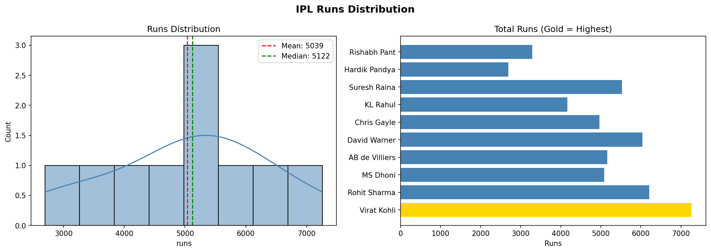
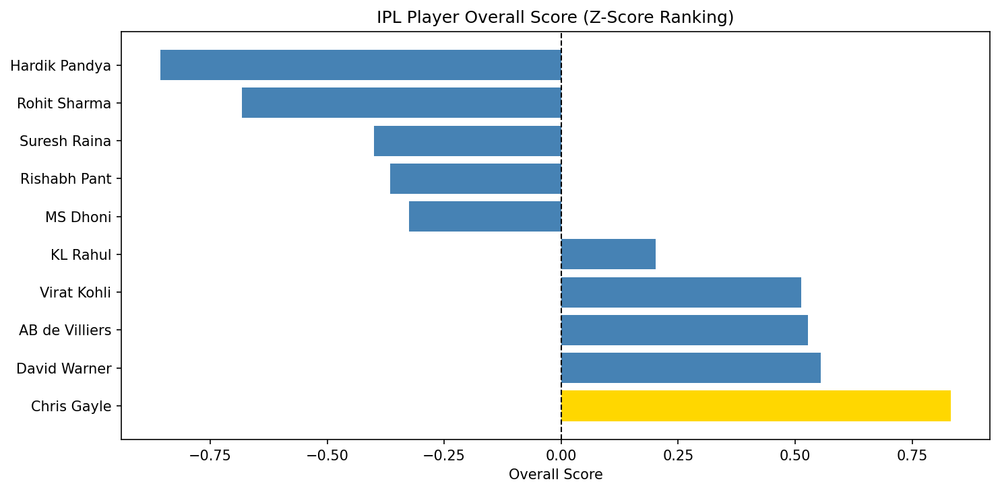

# 🏏 IPL Player Stats Analyser

A data science project that performs **statistical analysis** on IPL batting data using Python. Uses descriptive statistics, correlation analysis, z-score ranking, and data visualization to find insights about player performance.

---

## 📸 Output




---

## 📊 What It Analyses

- **Basic Stats** — Mean, Median, Std Dev for runs, average, strike rate
- **Consistency Analysis** — Coefficient of Variation to find most consistent batsman
- **Correlation Matrix** — Does higher average = higher strike rate?
- **Distribution of Runs** — How runs are spread across players
- **Z-Score Ranking** — Overall best player using standardized scores

---

## 🛠️ Tech Stack

| Tool | Purpose |
|---|---|
| Python | Core language |
| pandas | Data manipulation |
| numpy | Numerical operations |
| matplotlib | Charts and dashboards |
| seaborn | Statistical visualizations |
| scipy | Statistical analysis + Z-scores |

---

## 🏏 Players Analysed

| Player | Team | Matches | Runs | Average | Strike Rate |
|---|---|---|---|---|---|
| Virat Kohli | RCB | 237 | 7263 | 37.25 | 130.0 |
| Rohit Sharma | MI | 243 | 6211 | 29.86 | 130.6 |
| MS Dhoni | CSK | 234 | 5082 | 39.70 | 135.9 |
| AB de Villiers | RCB | 184 | 5162 | 39.70 | 151.7 |
| David Warner | SRH | 175 | 6041 | 42.59 | 139.7 |
| Chris Gayle | PBKS | 142 | 4965 | 42.01 | 148.9 |
| KL Rahul | PBKS | 115 | 4163 | 45.25 | 135.8 |
| Suresh Raina | CSK | 205 | 5528 | 34.00 | 136.7 |
| Hardik Pandya | MI | 121 | 2693 | 30.60 | 147.9 |
| Rishabh Pant | DC | 98 | 3284 | 35.69 | 148.2 |

---

## 🚀 How to Run

**1. Clone the repo**
```bash
git clone https://github.com/anayduggal22/ipl-stats-analyser
cd ipl-stats-analyser
```

**2. Create virtual environment**
```bash
python -m venv venv
venv\Scripts\activate
```

**3. Install dependencies**
```bash
pip install -r requirements.txt
```

**4. Run the notebook**
```bash
jupyter notebook cricket_stats.ipynb
```

Run all cells in order. Charts will be saved automatically.

---

## 📁 Project Structure

ipl-stats-analyser/
│
├── cricket_stats.ipynb      # Main analysis notebook
├── cricket_runs.png         # Runs distribution chart
├── player_ranking.png       # Z-score ranking chart
├── requirements.txt         # Dependencies
├── .gitignore               # Files to ignore
└── README.md                # This file
---

## 🔍 Key Insights

- **Most runs:** Virat Kohli — 7263 runs in 237 matches
- **Best average:** KL Rahul — 45.25
- **Best strike rate:** AB de Villiers — 151.7
- **Overall best (Z-score):** Run the notebook to find out!

---

## 📈 Analysis Breakdown

### 1. Basic Descriptive Statistics
Mean, median, and standard deviation calculated for runs, batting average, and strike rate across all players.

### 2. Consistency Analysis
Coefficient of Variation (CV = Std/Mean × 100) used to rank players by consistency. Lower CV = more consistent performer.

### 3. Correlation Analysis
Pearson correlation matrix showing relationships between runs, average, strike rate, hundreds, and fifties. Visualized as a heatmap.

### 4. Z-Score Ranking
All stats standardized to the same scale using z-scores. Combined score gives a fair overall ranking across different metrics.

---

## 🧠 What I Learned

- Descriptive statistics on real sports data
- Coefficient of Variation for consistency measurement
- Pearson correlation between batting metrics
- Z-score standardization for fair cross-metric comparison
- Multi-chart dashboards with matplotlib and seaborn
- Statistical visualization with seaborn heatmaps

---

## 👤 Author

**Anay Duggal**
GitHub: [@anayduggal22](https://github.com/anayduggal22)

---

## 📄 License

MIT License — free to use and modify.